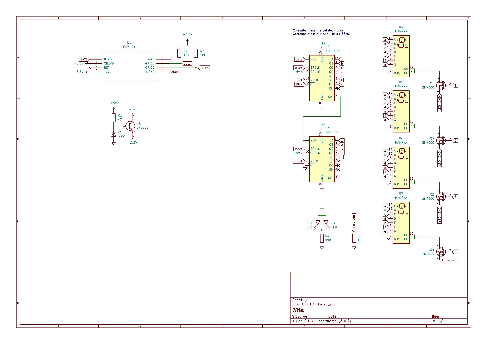

# Clock3D
A fully 3D printed and programmed clock!

## Schematics

## 3D models
You can download my modied 3D models directly from [Tinkerkad](https://www.tinkercad.com/things/gCL7NT3DZdE).
Original 3D models by [parallyze](https://www.thingiverse.com/parallyze) can be found [here](https://www.thingiverse.com/thing:3865571).
